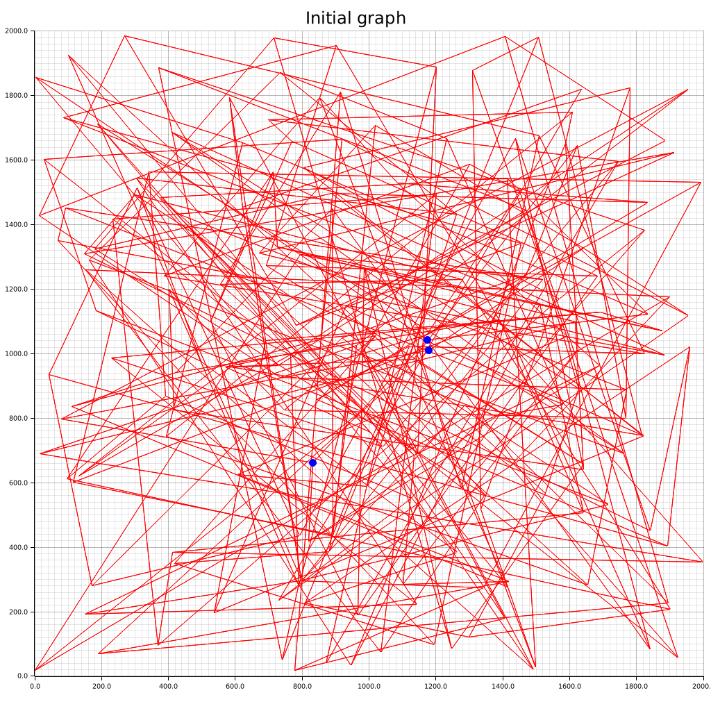
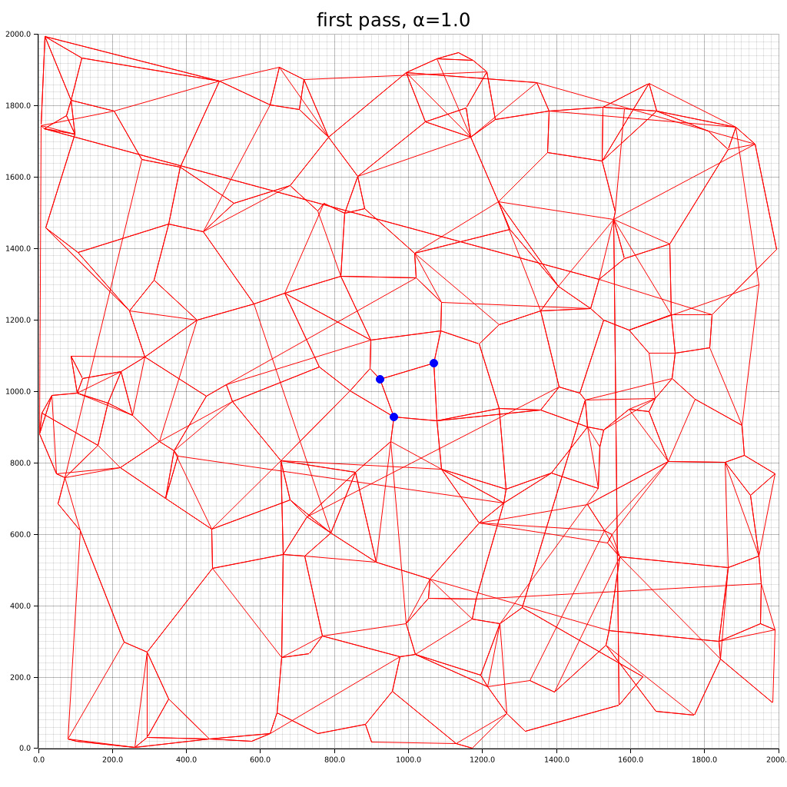
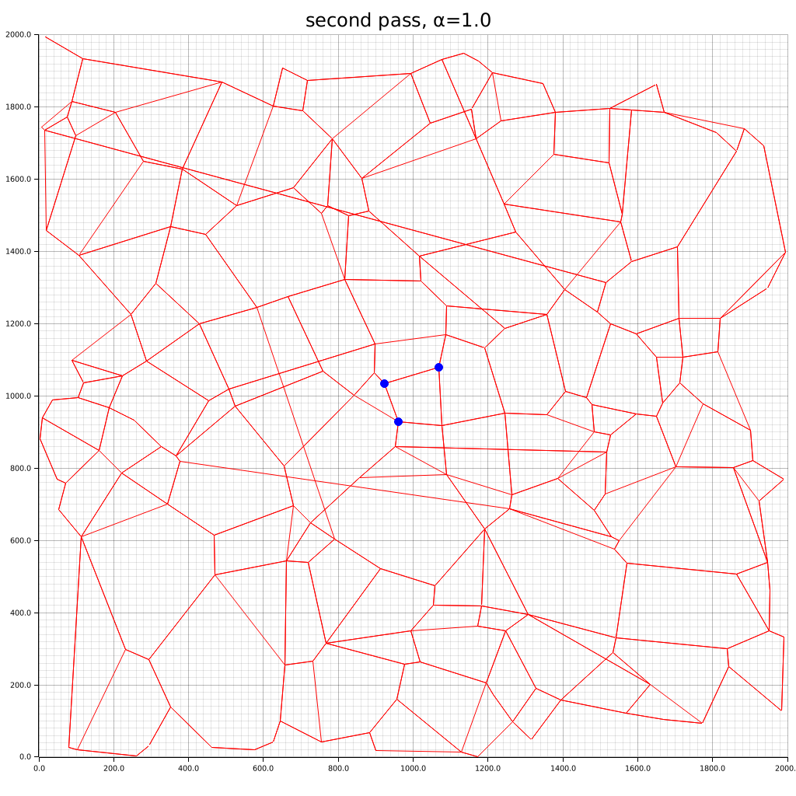

# vdb

Toy implementation of [Vamana (DiskANN) paper](https://proceedings.neurips.cc/paper/2019/file/09853c7fb1d3f8ee67a61b6bf4a7f8e6-Paper.pdf) in Rust

## Plotted Graphs

Here are the 2D vector plots generated by this Vamana implementation:

## Objective of project

1. Deep dive into vector dbs
2. Get more Rust practice
3. Understand Vamana index and disk storage of index
4. Try out benchmarking, see [qdrant](https://qdrant.tech/benchmarks/)
5. Explore if possible to try out io_uring

## TODO

- Right now we're only storing vectors, how do we make it useful? i.e. Map it back to the text
  - Should be storing a documentID
- Explore disk storage representation
- Arbitrary vector dimension
- Dig into Fresh-DiskANN, Filtered-DiskANN
- Dig into <https://github.com/infrawhispers/anansi>
  - How is RocksDB used?
- qdrant benchmarking

## Experiments

### Experiment 1: Load everything in-memory

1. Measure RAM usage
2. Measure greedy_search latency
