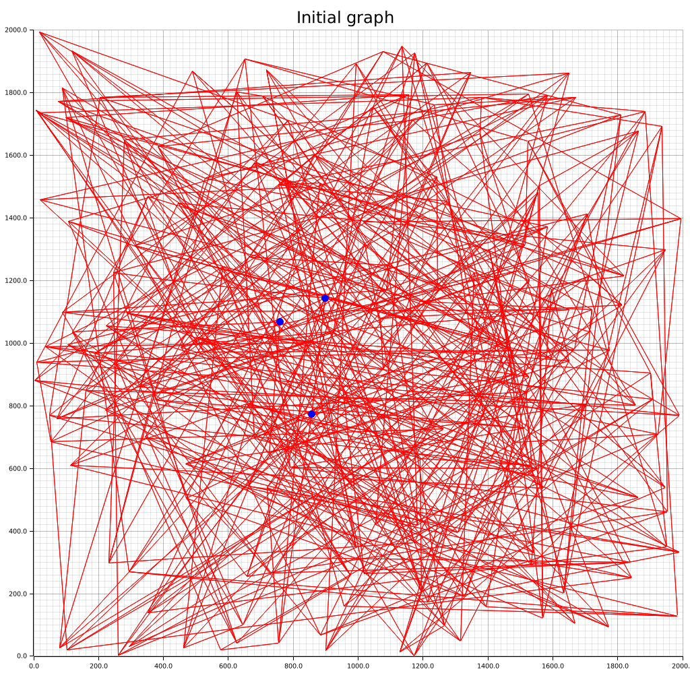

## vdb

Toy implementation of [Vamana (DiskANN) paper](https://proceedings.neurips.cc/paper/2019/file/09853c7fb1d3f8ee67a61b6bf4a7f8e6-Paper.pdf) in Rust.

## Table of contents

- [vdb](#vdb)
- [Table of contents](#table-of-contents)
- [Plotted graphs](#plotted-graphs)
- [Improving indexing performance with SIMD](#improving-indexing-performance-with-simd)
  - [Profiling](#profiling)
  - [Using SIMD to calculate euclidean distance](#using-simd-to-calculate-euclidean-distance)
- [FreshDisk](#freshdisk)
- [Streaming the dataset](#streaming-the-dataset)
- [Benchmarks](#benchmarks)
- [Storing and querying data](#storing-and-querying-data)
- [Limitations (i.e. improvements that can be made)](#limitations-ie-improvements-that-can-be-made)

## Plotted graphs

Here are the 2D vector plots generated by this Vamana implementation:

- degree_bound = 5
- r (initial connections) = 3
- dataset size = 200

The blue points are the top 3 results from trying to `greedy_search(1000.0,1000.0)` on each respective graph. We can that it yielded accurate results after the first pass.




## Improving indexing performance with SIMD

Inspired from [qdrant's benchmarks](https://qdrant.tech/benchmarks/), I decided to run vdb with the [dbpedia-entities-openai-1m](https://huggingface.co/datasets/KShivendu/dbpedia-entities-openai-1M) dataset.

- 1 million of 1536 dimension vectors

Using only in-mem indexing, the full indexing's latency came at `200s ~ 250s`

### Profiling

To identify the bottleneck, I used [cargo flamegraph](https://github.com/flamegraph-rs/flamegraph) to profile the indexing on just 1 parquet file of the dataset (i.e. 38k of 1536 dimension vectors).


> See the `vdb::graph::graph::Graph::Index` trace

We can see that `euclidean_distance` takes up the majority of CPU time in `greedy_search` and `robust_prune`.
My simple implementation below scales linearly with the no. of dimensions. Hence, it's slow for our 1536 dimension dataset.

```rust
fn euclidean_distance(a: &[f32], b: &[f32]) -> i64 {
    let mut squared_distance: f32 = 0.0;
    for i in 0..a.len() {
        let difference = a[i] - b[i];
        squared_distance += difference * difference;
    }
    squared_distance.sqrt() as i64
}
```

### Using SIMD to calculate euclidean distance

SIMD is a natural fit for this calculation. Using the [simsimd](https://docs.rs/simsimd/latest/simsimd/index.html) crate is trivial:

```rust
use simsimd::SpatialSimilarity;

fn euclidean_distance(a: &[f32], b: &[f32]) -> i64 {
    let l2sq_dist = f32::l2sq(a, b); 
    l2sq_dist.unwrap() as i64
}
```

The full in-mem indexing's latency now takes around `40s~51s`, about a 5x improvement. From the updated flamegraph, we can also see that `euclidean_distance` is no longer hogging the CPU time.

- Reading the dataset became the dominating factor


> See the `vdb::graph::graph::Graph::Index` trace

## FreshDisk

To handle large datasets, I implemented `src/storage/fresh_disk.rs` based on the [FreshDisk paper](https://arxiv.org/pdf/2105.09614). It's quite similar to LSM trees.

## Streaming the dataset

While trying to use the load and index `dbpedia-entities-openai-1M` the dataset into the FreshDisk index, the process would hang/OOM. The full dataset is 18G and I would have other processes running on my PC.

To mitigate this, instead of loading in the full dataset, the vectors are loaded from each file lazily via an `Iterator`.

- Noted that this interferes with indexing latency

## Benchmarks

Using the 1,000,000 vectors of 1536 dimension from the dbpedia dataset, I compared the following storage implementation.

- [In-mem](src/storage/inmem.rs) where all indexes and operations are in-mem
- [Naive disk](src/storage/disk.rs) where all indexes and operations are on disk
- [Fresh-Disk](src/storage/fresh_disk.rs) where indexes and operations are in a mix of in-mem and on-disk
  - The numbers reflects the hybrid approach

| Storage type | Indexing time |
|--------------|---------------|
| In-mem       | 51s           |
| Naive disk   | 1829s         |
| Fresh-Disk   | 219s          |

## Storing and querying data

Initially, the toy implementation only stored vectors and not the text data. I decided to add it in for a more practical showcase. Data is all stored in-memory.

Because the embeddings are via OpenAI's paid `text-embedding-ada-002` and to keep it simple, I will query the index with a known vector from the dataset.

The query vector is loaded from [dataset/query.txt](dataset/query.txt). Using the query vector of `<dbpedia:ASCII>`, we query the index with `k=5` (5 most similar). We see that we are able to retrieve the correct match (1st) and other relevant matches.

> Due to the nature of approximation and randomization, we don't always get the correct match across multiple queries

```text
ASCII (/ˈæski/ ASS-kee), abbreviated from American Standard Code for Information Interchange, is a character-encoding scheme (the IANA prefers the name US-ASCII).  ASCII codes represent text in computers, communications equipment, and other devices that use text. Most modern character-encoding schemes are based on ASCII, though they support many additional characters.

ASCII art is a graphic design technique that uses computers for presentation and consists of pictures pieced together from the 95 printable (from a total of 128) characters defined by the ASCII Standard from 1963 and ASCII compliant character sets with proprietary extended characters (beyond the 128 characters of standard 7-bit ASCII). The term is also loosely used to refer to text based visual art in general.

ISO/IEC 8859-1:1998, Information technology — 8-bit single-byte coded graphic character sets — Part 1: Latin alphabet No. 1, is part of the ISO/IEC 8859 series of ASCII-based standard character encodings, first edition published in 1987. It is generally intended for Western European languages (see below for a list).

ISO/IEC 8859-15:1999, Information technology — 8-bit single-byte coded graphic character sets — Part 15: Latin alphabet No. 9, is part of the ISO/IEC 8859 series of ASCII-based standard character encodings, first edition published in 1999. It is informally referred to as Latin-9 (and was for a while called Latin-0).

ISO/IEC 8859 is a joint ISO and IEC series of standards for 8-bit character encodings. The series of standards consists of numbered parts, such as ISO/IEC 8859-1, ISO/IEC 8859-2, etc. There are 15 parts, excluding the abandoned ISO/IEC 8859-12. The ISO working group maintaining this series of standards has been disbanded.ISO/IEC 8859 parts 1, 2, 3, and 4 were originally Ecma International standard ECMA-94.
```

## Limitations (i.e. improvements that can be made)

As this is a toy project to learn more about Rust and db development, there are several limitations

1. Does not support delete
2. Indexes are rebuilt every time
3. WAL not supported